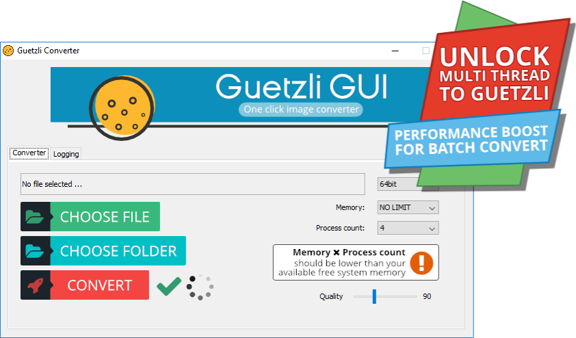

# Guetzli Converter

Guetzli made easy!
One click that stands between you and your Guetzli JPEG :)
Batch convert supports **multi-thread** encoding.

**Guetzli Converter** is a simple GUI of the command line tool Guetzli developed by Google. You can find the official project on Github: https://github.com/google/guetzli

**Guetzli Converter** just simplify the process of creating a Guetzli encoded JPEG by providing a graphical interface.

**Guetzli Converter**'s batch processing make it possible to run Guetzli multi-thread. Unlocking you much more performance if you have a bunch of files to convert.

## Repository

Java source of a **Guetzli Converter GUI**  done by [polygOnetic](https://www.polygonetic.com)

## Binary Download

Compiled binaries can be found here: https://www.guetzliconverter.net/
